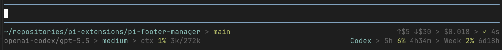

# pi-footer-manager

One footer, many extensions: build flexible Pi footers from reusable fragments with configurable layout and built-in fragments instead of competing `setFooter()` calls.

`pi-footer-manager` lets one extension own `ctx.ui.setFooter(...)` while built-in and custom fragments are arranged through a shared API, with flexible rows, regions, widths, alignment, and redraw/invalidation flow.



## Included extensions

- `footer-manager/index.ts` — cooperative footer owner
- `fragments/footer-timer-fragment.ts`
- `fragments/quota-footer-fragment.ts`
- `fragments/quota-footer-fragment-text.ts`
- `fragments/context-gauge-text-fragment.ts`

## How configuration works

Layout is configured under `footerManager.layout` in Pi settings.

- `separator` controls how fragments are joined inside a region
- `rows` is an array of footer rows
- each row has `regions`
- each region can set:
  - `width`: fraction like `0.35` or `"auto"`
  - `align`: `"left"`, `"center"`, or `"right"`
  - `fragments`: fragment ids to render in that region

Project settings override global settings.

## Example: simple two-region footer

```json
{
  "footerManager": {
    "layout": {
      "separator": " > ",
      "rows": [
        {
          "regions": [
            { "width": 0.65, "align": "left", "fragments": ["cwd.full", "git.branch", "context.gauge"] },
            { "width": 0.35, "align": "right", "fragments": ["model.name", "thinking.level", "statuses"] }
          ]
        }
      ]
    }
  }
}
```

## Example: mostly automatic sizing

```json
{
  "footerManager": {
    "layout": {
      "rows": [
        {
          "regions": [
            { "align": "left", "fragments": ["cwd.full", "git.branch"] },
            { "width": 0.35, "align": "right", "fragments": ["model.name", "statuses"] }
          ]
        }
      ]
    }
  }
}
```

In mixed layouts, fixed fractional regions are allocated first and the remaining width goes to `"auto"` regions.

## Example: multi-row footer

```json
{
  "footerManager": {
    "layout": {
      "rows": [
        {
          "regions": [
            { "align": "left", "fragments": ["cwd.full", "git.branch"] },
            { "align": "right", "fragments": ["model.name", "thinking.level"] }
          ]
        },
        {
          "regions": [
            { "align": "left", "fragments": ["context.gauge.text", "quota.current.text", "timer.work"] }
          ]
        }
      ]
    }
  }
}
```

## Built-in fragments

Main built-ins provided by `footer-manager` include:

- `cwd.full`
- `git.branch`
- `model.name`
- `model.cost`
- `model.cacheCost`
- `cache.hit`
- `cache.hit_counts`
- `thinking.level`
- `context.gauge`
- `cost.total`
- `statuses`

The included fragment extensions add examples like:

- `timer.work`
- `context.gauge.text`
- `quota.current`
- `quota.current.text`

## Custom fragments

Other extensions should register fragments instead of calling `ctx.ui.setFooter(...)` directly.

See detailed fragment API docs and examples in:

- [`footer-manager/README.md`](./footer-manager/README.md)

## Check

```bash
npm run check
```

## Publish dry run

```bash
npm run release:check
```
